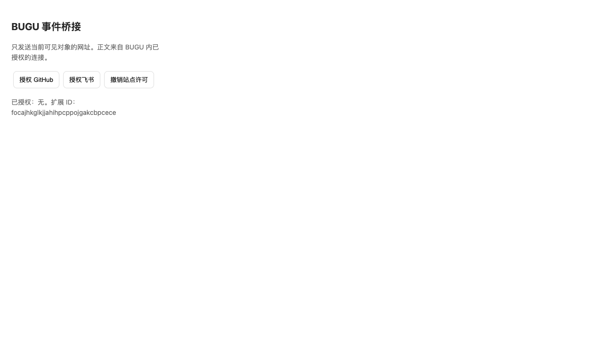

# 猜你想做：补充验收（2026-09-20）

本轮覆盖原生观察故障、真实隔离浏览器、按时间顺序的学习回放和新提示的完整模型复跑。测试全部使用合成输入和独立目录。下列通过项不能替代商店分发、代码签名、Windows 10/11 与各系统输入法的实机验收。

## 真实 Codex 完整复跑

本轮完整执行 **360/360，359 条符合预期（99.72%）**，重试 0 次，未改动锁定集标注。分类 79/80、双边关联 120/120、候选推荐 160/160。138 个允许推荐的样本全部返回正确目标，22 个应弃答样本全部弃答。200 个语义 family 中 199 个的全部变体通过；时间/顺序变体不能当成独立样本，不据此声称生产环境 99%。

失败项 `classify-unknown-3`：孤立的“你怎么看？”预期为信息不足，模型判断为需要回复。原始输出完整保留；分类单项准确率为 98.75%，没有用总分掩盖这个边界。

- [原始逐条结果](codex-full-results.json)、[完整报告与提示/语料哈希](codex-full-report.json)、[分项指标](metrics.json)。
- CLI 默认模型；提供商未向运行器暴露实际 token/费用，记录为未知。合成数据经过真实 Codex CLI 请求，没有使用规则替代模型。
- 旧提示的完整基线和新提示的 22 条定向复测保留在 [9 月 19 日目录](../next-action-2026-09-19/README.md)。本轮是新的全量结果，不拼接历次成功样本。
- Claude 此前连续超时，本轮没有重复消耗；Responses/Completions 尚无本次评测凭据，仍不能标为多提供商完整验收。

## 构建与长时间检查

运行时代码 `cb119a2` 的[手动构建](https://github.com/bread-ovO/bugu-notes/actions/runs/35456276426)在 Windows x64、macOS arm64/x64、Linux x64 全部通过；五安装包和校验值检查通过，发布步骤跳过，未创建 tag/Release。后续只调整测试覆盖与文档。

[24 小时运行中的检查点](soak-24h-running-checkpoint.json)保存了约 30 分钟记录，结果仍为 `running`。调用数保持 7、窗口保持 1，采样间隔最大约 10.14 秒。当前进程继续运行；不能据此标成 24 小时通过，更不能当成真实系统 helper 的资源认证。新增测试还会拒绝超过 60 秒的采样空档；当前已启动的测试保留原快照，最终仍需按原始时间戳复核连续性。

## 原生观察与浏览器

- 新增 9 条原生宿主单测：权限失效、锁屏、有限重启、取消重启、旧进程回调、过期/重复确认、候选身份、过大帧和损坏输入管道；相关单测总数为 132。
- macOS 的 AX 调用设置超时，窗口切换或 AX 失败清空旧对象；权限撤回释放确认键。
- Windows 扫描前后核对前台窗口、应用身份和候选版本，防止切换瞬间把旧来源当成新窗口的内容。使用有超时控制的 `CUIAutomation8`；隔离 self-test 创建接口并读回 100 ms 的连接/事务超时，不读取用户窗口。接口依据见 [Microsoft CUIAutomation8](https://learn.microsoft.com/en-us/previous-versions/windows/desktop/legacy/hh448746(v=vs.85))。
- 11 条受影响 Electron E2E、类型检查、包边界、本机 helper/配对协议、macOS arm64 `package:dir` 通过。未运行全部 E2E。
- [真实浏览器验收](extension-acceptance.json)：Chromium 145.0.7632.6、独立临时 profile。实际许可 → 已打开网页无需刷新 → Native Messaging/Keychain → 前后台切换 → 桌面桥接重启 → 撤权 → 浏览器重启，全部通过。HTTPS 工作页由夹具返回，不接触真实账号。



这是交互验收，需要在测试浏览器中接受原生权限弹窗并保持窗口前台。早先尝试出现权限等待超时和切换后未恢复的失败；完成权限交互并保持前台的完整复跑通过。该用例对桌面焦点敏感，没有把页面 `hasFocus()` 伪造成 true，也没有关闭前台检查。

## 学习回放

[逐步结果](learning-replay.json)包含 8 条设计的行为流、139 个预测时点。每一步只使用此前选择，预测完成后才加入当前实际选择。它验证分类/归因之后的确定性学习逻辑，不调用真实模型，不代表 139 个独立用户样本。

| 行为流 | 主动推荐/时点 | 推荐正确 | 结论 |
| --- | --- | --- | --- |
| 稳定的独立选择 | 11/16 | 11 | 前五次不抢先推荐 |
| 模型双侧归因 | 10/20 | 10 | 较弱证据需要更多独立事件 |
| 工具选择混合 | 0/20 | — | 没有稳定偏好时弃答 |
| 推荐诱导点击 | 0/20 | — | 不用自己推荐的结果训练自己 |
| 同一事项重复切换 | 0/20 | — | 不虚增独立样本 |
| 新事件类型 | 8/18 | 8 | 新类型单独学习 |
| 项目特例与删除 | 11/18 | 8 | 初期有三次旧偏好迁移错误；随后弃答，再形成特例；删除特例后回落 |
| 纠错与撤销 | 1/7 | 1 | 有效贡献撤回，撤销后恢复 |

所有约束检查通过：项目对象不串用，停留时长变化不改结果，冷启动与撤销符合契约。保留项目特例前的三次预测错误；不能将“约束通过”表述为学习预测 100% 准确。固定推荐 Codex 的基线始终作答，覆盖率与本方案不同，逐流比较在 JSON 中。真实价值仍需经同意的试用对照。

## 运行方式

在仓库根目录执行；没有全局 pnpm 时使用 `npx --yes pnpm@10.34.5`。

```sh
pnpm test:next-action
pnpm test:next-action:native
pnpm test:next-action:e2e
pnpm eval:next-action:learning --output test-results/next-learning-replay.json
BUGU_EXTENSION_UI=1 pnpm exec playwright test tests/desktop/next-extension.spec.ts
BUGU_NEXT_SOAK_SECONDS=86400 BUGU_NEXT_SOAK_REPORT=test-results/next-soak-24h.json pnpm exec playwright test tests/desktop/next-soak.spec.ts
```

扩展用例当前支持 macOS/Linux 的独立 profile；Windows 注册表路径不在该用例范围。稳定性用例复制固定构建，隐藏测试窗口，每分钟写原子检查点，`outcome=running` 不等于验收通过。模型与应用启动为夹具，仍不能替代真实 helper 的 24 小时资源验收。
