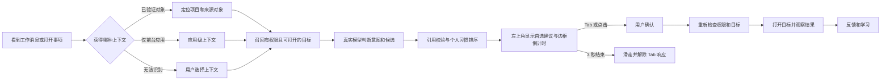
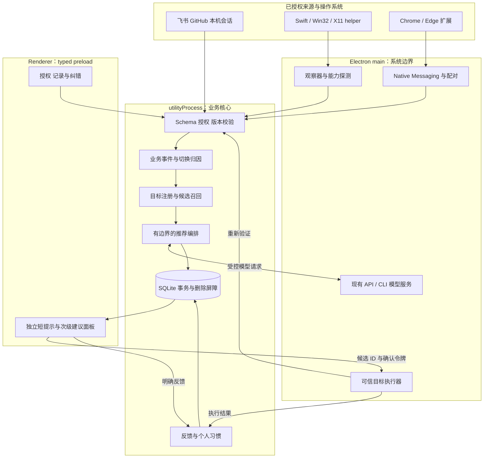
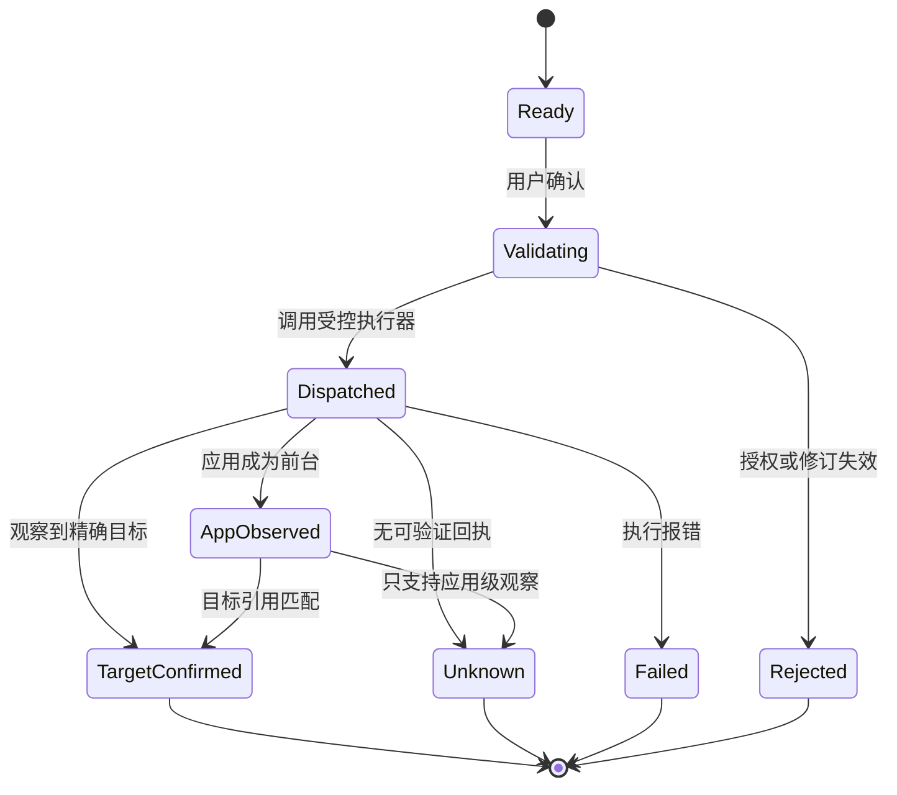
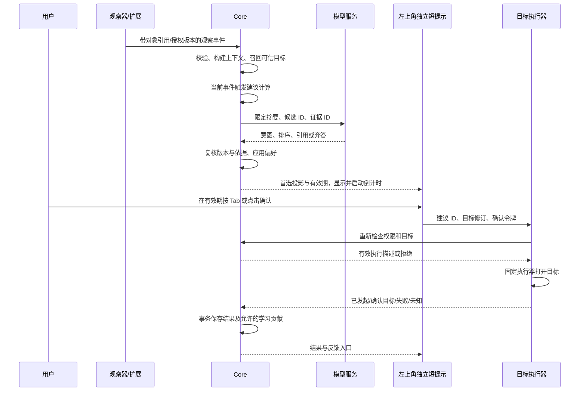
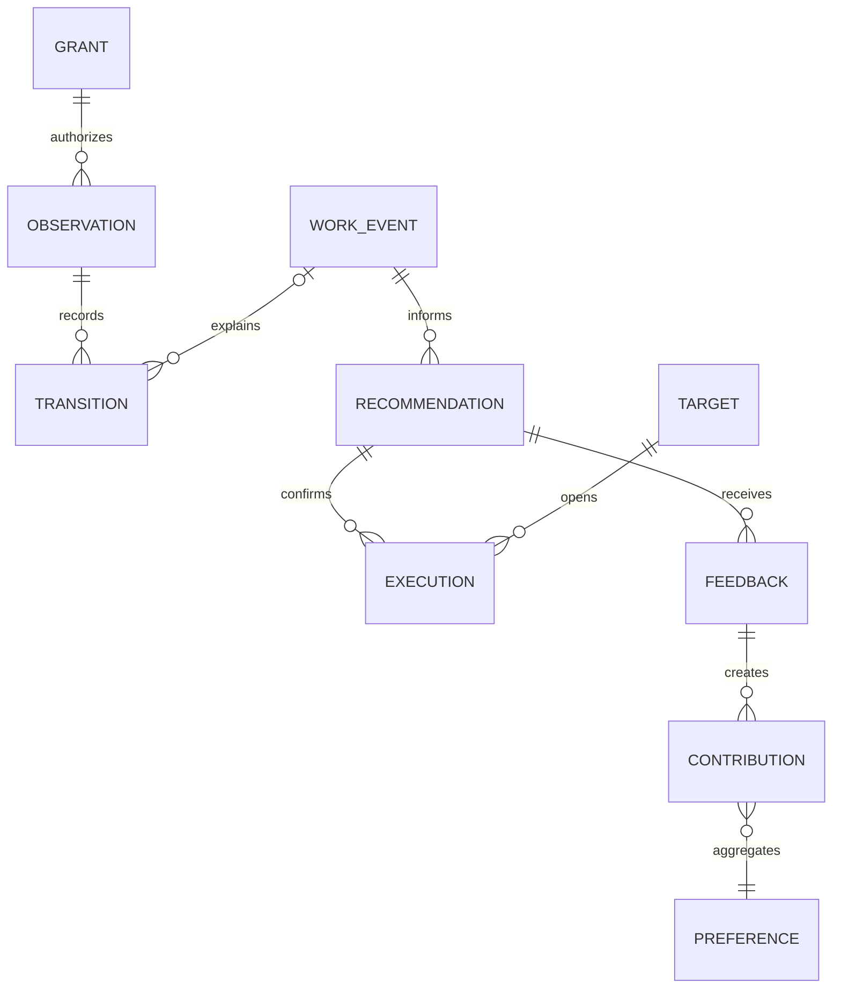

# BUGU「猜你想做」完整实现方案

状态：**方案待评审，功能未实施**。日期：2026-09-18。代码核对基线：`upstream/main@8b0d594`。对应 [Issue #158：feature: 猜你想做](https://github.com/bread-ovO/bugu-notes/issues/158)。

本方案定义一次完整的功能交付：从用户看到工作消息，到理解意图、学习习惯、推荐目标、确认跳转、纠错、撤权删除，全部闭环后才开放正式入口。下文的实施顺序是同一交付包内的依赖关系，不代表分多个版本交付半成品。指标是验收目标，不能当作已经取得的成绩。

阅读顺序：第 1–7 节确认产品体验与授权；第 8–16 节是架构、算法、数据与异常设计；第 17–20 节是评测、实施任务和发布门禁。

## 1. 产品要交付什么

**用户遇到一类工作事件时，不咕在屏幕左上角短暂提示可能想去的工具；按 Tab 即可跳转，不操作则倒计时结束后滑走。** 本功能独立于桌宠，使用越久，建议越符合本人处理不同事情的习惯。

例如：飞书有人要求继续处理登录问题。BUGU 将这条消息与同项目中已授权的编码会话、关联 PR 联系起来，给出「继续处理登录问题 · Codex」和「查看修复 PR · GitHub」。用户确认后打开经过验证的目标；若当前客户端只能打开应用，按钮必须写「打开 Codex」，不能写成「继续该会话」。

核心习惯是「遇到哪类事情 → 选择哪个工具处理」；停留时长不决定事件关联。工具选择可以应用于新的同类事件，具体会话和文档仍按当前项目的授权与证据定位。

它与现有三项核心能力的关系：

| 核心能力 | 本功能承担的工作 | 原能力保持的职责 |
| --- | --- | --- |
| 插件多信源 | 将来源对象映射到可执行的下一步目标 | 连接器负责授权、同步和原文依据 |
| AI 识别任务与进展 | 理解当前消息的意图，关联已有事项和目的地 | 事项是否完成仍由证据与人工决定 |
| 桌宠 | 无运行依赖；关闭、未安装模型或不显示桌宠时推荐照常工作 | 桌宠继续承担原有陪伴功能，不作为本功能入口或提示容器 |

衡量价值的主要指标是「从明确上下文到正确目标的耗时下降」和「高置信推荐的正确率」，不能只统计推荐次数或点击率。

## 2. 范围与完整交付边界

一次交付必须包含：

1. 已授权来源的上下文识别，以及可选的本机应用使用习惯观察。
2. macOS、Windows、Linux 的能力探测、正常路径和明确的受限模式。
3. Chrome / Edge 扩展：按站点授权，把当前受支持页面关联到来源对象。
4. 真实模型的意图理解与候选排序；个人习惯只在可信候选中调整排序。
5. 独立左上角短提示、临时 Tab 跳转、边框倒计时与退场动画，以及错过后主动查看建议的入口。
6. 可信目标注册、跳转前复核、执行结果区分、失败恢复。
7. 冷启动、无模型、权限不足、离线、目标失效等完整状态。
8. 学习记录查看、暂停、排除应用、纠错、撤权、删除以及迟到结果保护。
9. 本地离线回放、真实模型评测、针对性 E2E、三平台安装包验证。
10. 发布包、扩展安装引导、兼容矩阵、故障诊断和卸载清理。

本功能不要求自动操作外部软件的输入框，不自动发消息、执行代码、运行模型生成的命令，也不改变事项业务状态。不通过连续截图、录音、剪贴板读取或全局键盘记录建立习惯。

「完整」指上述闭环与支持矩阵全部成立。第三方软件没有公开定位接口、没有可访问对象 ID 时，提供诚实的应用级入口；不把猜测的窗口标题当成已经定位到会话。这是本次确定的产品行为，不是留下一个按钮等下一版补实现。

## 3. 用户使用流程

### 3.1 首次启用

设置中新增一张「猜你想做」卡片，默认关闭。点击启用进入三步短向导：

1. **选择上下文来源**：勾选已有授权的项目与连接；未连接的项目直接进入已有连接流程。此步骤不扩大原连接授权范围。
2. **选择学习范围**：默认只记录 BUGU 内的目标选择与反馈；可主动开启指定应用的切换记录、指定网站的页面上下文。应用内容识别单独申请系统权限，不随应用切换开关默认开启。
3. **确认模型与提示方式**：显示实际模型服务、拟发送的字段，以及“左上角提示 3 秒、提示期间按 Tab 跳转”的行为。明确这是临时系统级按键响应，用户可关闭主动提示或关闭学习。完成后用用户选择的一个真实上下文做首个推荐，不自动注入演示任务。

系统权限拒绝后，向导可以完成，卡片显示实际能力，例如「应用内可用 · 未开启跨应用识别」。不循环弹权限框。

### 3.2 日常主流程



用户不需要打开跟进清单或桌宠。模型给出有效建议后，在当前工作屏幕的可用区域左上角显示一条首选；Tab 或点击确认。错过后可通过 BUGU 顶栏或手动快捷键查看仍有效的建议及其他候选。没有可靠上下文时不弹猜测性空卡；主动查看时允许用户选择授权对象。

### 3.3 六条必须完整跑通的场景

| 场景 | 输入 | 推荐与动作 | 学习或保护 |
| --- | --- | --- | --- |
| 接到修复反馈 | 授权飞书消息与关联事项 | 打开已关联编码会话；能力不足则明确打开对应应用 | 只学本项目的目标偏好 |
| 需要检查交付 | 消息明确提到已知 PR | 打开对应 PR 页面 | PR 合并不自动等于事项完成 |
| 查找依据 | 消息询问文档或讨论 | 打开验证过的文档链接或来源会话 | 不让模型编造链接 |
| 继续之前工作 | 用户唤起，只有应用上下文 | 推荐已固定或有关联依据的近期目标 | 不宣称知道刚看了哪条消息 |
| 同类事情选择同一工具 | 多个不同事件中有效的工具选择样本 | 新的同类事件优先本人偏好的工具，再找具体目标 | 不按停留时长学习，不覆盖本次明确指定目标 |
| 推荐错误或无法打开 | 用户纠错或执行器报错 | 可换目标、忽略、排除，并可回到原上下文 | 纠错有效，失败不算偏好 |

## 4. “看到消息”的证据必须分级

操作系统无法证明用户眼睛读过某条消息。本产品记录的是**可观察到的展示、打开与选择事件**；界面与数据库禁止把它们统一命名为 `message_read`。

| 等级 | 事件 | 能得出的结论 | 不能得出的结论 |
| --- | --- | --- | --- |
| E0 | 连接器同步到消息 | 有新来源记录 | 用户已经看到 |
| E1 | 应用成为前台 | 用户切到了这个应用 | 打开了哪条消息、理解了内容 |
| E2 | 支持的页面/客户端展示了可验证对象 | 某个来源对象处于前台可见区域 | 用户已阅读、准备执行 |
| E3 | 用户在 BUGU 或受支持入口主动打开对象 | 用户选择了这个上下文 | 后续切换一定与它有关 |
| E4 | 用户确认建议、主动固定或明确纠错 | 有明确的目标选择或偏好反馈 | 工作已经完成 |

E2 默认要求页面处于前台、对象有效可见至少 1.5 秒；这是降噪参数，不是阅读证明。最小可见比例与页面适配规则由适配器测试固定。遮挡无法可靠识别时降低等级，不宣传精确曝光。

历史消息导入、补抓旧消息、会话文件修改、通知到达都不能制造 E2/E3。AX/UIA 只能拿到会话标题、拿不到稳定对象 ID 时，记录 E1 或会话级上下文，不能凭标题相似度升级为消息级证据。

## 5. 支持矩阵与原生实现选择

### 5.1 平台能力

| 平台 | 应用切换观察 | 精确来源上下文 | 唤起与跳转 | 权限不足时的完整行为 |
| --- | --- | --- | --- | --- |
| macOS arm64 / x64 | Swift helper 订阅 NSWorkspace 应用激活事件 | BUGU 自身、扩展；可选 AX 适配受支持客户端 | Electron 快捷键、验证过的 URL / 应用激活 | 应用内选择上下文；不请求录屏来替代 AX |
| Windows 10 / 11 x64 | C++ helper，WinEvent 前台事件与进程身份 | BUGU 自身、扩展；可选 UI Automation 适配器 | Electron 快捷键、验证过的 URL / 应用激活 | 不提权；高权限窗口不可读时退回应用级 |
| Linux X11 x64 | C++ helper 订阅 EWMH 前台窗口属性；只取已允许应用的身份 | BUGU 自身、扩展 | Electron 快捷键、已注册应用入口 | 缺少窗口管理器能力时用应用内入口 |
| Linux Wayland x64 | 不假定存在统一的全局前台观察接口 | BUGU 自身、扩展中的授权页面 | 可用时走 GlobalShortcutsPortal；否则托盘/应用内入口 | 清楚显示「页面与应用内上下文」；不伪装成全桌面观察 |

原生组件只负责观察和固定动作，不放模型、学习算法、业务权限判断。选择 Swift 复用现有 macOS 原生构建方式；Windows C++ 直接接 Win32/UIA，不引入用户需另装的 .NET 环境；Linux helper 单独编译，X11 依赖动态探测，不能导致 Wayland 启动失败。

Apple 的应用激活通知提供运行应用信息；Windows 的 WinEvent 提供窗口/可访问性事件，这些接口本身都不提供用户读过消息的证明。UIA/AX 的对象可见性取决于目标软件实际暴露的能力。[Apple NSWorkspace](https://developer.apple.com/documentation/appkit/nsworkspace/didactivateapplicationnotification)、[Apple AX 授权](https://developer.apple.com/documentation/applicationservices/1459186-axisprocesstrustedwithoptions)、[Microsoft WinEvent](https://learn.microsoft.com/en-us/windows/win32/api/winuser/nf-winuser-setwineventhook)、[Microsoft UI Automation](https://learn.microsoft.com/en-us/windows/win32/winauto/uiauto-uiautomationoverview)。

快捷键注册必须检查返回值和占用；Wayland 由实际 Portal 后端决定可用性，不能把注册尝试当作成功。[Electron globalShortcut](https://www.electronjs.org/docs/latest/api/global-shortcut)、[XDG Portal 接口](https://flatpak.github.io/xdg-desktop-portal/docs/api-reference)。

### 5.2 来源与目的地

| 对象 | 本次必须交付的基础能力 | 精确定位能力如何成立 |
| --- | --- | --- |
| 飞书消息/会话 | 识别已有授权 chat/message 引用，打开验证过的会话或来源页 | 仅使用在指定客户端验证过的官方链接格式；无消息级入口时标注「打开会话」 |
| GitHub Issue/PR | 按已授权仓库与对象编号生成可信网页目标 | host、owner、repo、编号匹配连接记录，扩展可复用当前授权浏览器的现有标签页 |
| Codex / Claude Code / Kimi 会话 | 关联授权本地会话 ID、展示来源、打开已验证的应用/项目入口 | 具体会话恢复仅在版本配置中声明且实测通过；不猜私有 deeplink，也不运行自由生成的 CLI 命令 |
| 文档/网页 | 使用已收录且验证过的 HTTP(S) 来源链接 | 支持范围内定位页面；原本没有锚点就不能承诺跳到具体段落 |
| BUGU 事项 | 定位本项目内事项与来源证据 | 走 typed bridge 内部路由，检查事项尚存在且可访问 |
| 用户固定入口 | 本人选择并确认一个应用或来源目标 | 固定动作仍需经过同一验证器；不能固定任意脚本 |

这里的基础能力全部在本次交付中完成。精确消息定位是每个适配器的能力字段，不能用一个总开关假定所有客户端都支持。客户端版本变化后失效的精确模式必须撤回能力声明，并切换到明确标注的基础动作。

首次集成需产出 `target-capabilities.json`：记录平台、客户端版本、适配器版本、已验证的动作、测试样例与验证日期。文档不预填尚未在本机证实的协议参数。

### 5.3 浏览器扩展

选用 Manifest V3、TypeScript，共用协议包，先明确支持 Chrome 和 Edge 的稳定版本。安装向导列出经过验证的浏览器版本；其他浏览器仍能通过 BUGU 打开标准来源链接，但不宣称被动页面识别。

扩展只为用户勾选的网站申请 `optional_host_permissions`，适配器只提取来源对象 ID、规范化 URL、短标题、可见状态。默认排除隐身窗口；不抓取整个 DOM、Cookie、输入框内容或其他标签页正文。前台网页内容即使来自允许网站也必须当作不可信数据。

`activeTab` 只提供用户手势触发的临时能力，不能拿它冒充持续观察授权。用户未授权站点时，提供「将此页用于本次建议」的主动入口；被动识别只能在所选站点持久权限生效后运行。[Chrome activeTab](https://developer.chrome.com/docs/extensions/develop/concepts/activeTab)、[Chrome 权限列表](https://developer.chrome.com/docs/extensions/reference/permissions-list)。

扩展通过 Native Messaging 连接打包的 host；host 再通过当前用户的受限命名管道/Unix socket 连接运行中的 BUGU。host manifest 固定扩展 ID，不使用通配来源；service worker 校验消息发送页面，主程序再次校验项目授权、配对令牌、消息大小和序号。不开无认证本地 HTTP 端口。BUGU 退出后停止观察，不由浏览器暗中启动一个长期后台采集器。[Chrome Native Messaging](https://developer.chrome.com/docs/extensions/develop/concepts/native-messaging)。

## 6. 界面与键盘交互

### 6.1 主入口：左上角短提示，独立于桌宠

**用户确定的交互：左上角弹出一个小弹窗，展示两三秒，提示可能想去的工具；按 Tab 跳转，边框有轻量倒计时，时间到就滑走。** 默认展示 3 秒，允许用户改为 2 秒；需更长阅读时间的用户可选择延长或手动关闭，不强制所有人使用短时限。

弹窗是 `next-action` 自己管理的独立无边框窗口，不是桌宠气泡，也不依附主窗口。没有 Live2D 模型、桌宠隐藏、桌宠关闭、主窗口最小化时，只要 BUGU 仍运行并启用本功能，就应照常工作。窗口采用不激活方式显示，不将键盘焦点从飞书或编辑器抢走。

位置按当前源应用所在屏幕的可用区域计算，距上、左各 16 px；无法确认源屏幕时使用指针所在屏幕。显示后不跟着指针移动，不每个显示器都弹一份；处理缩放、菜单栏、安全区域与显示器移除。多屏规则是当前建议实现，可在本轮交互继续调整。

默认宽 360 px、高 64 px、圆角 12 px、内边距 12 px，图标 20 px。只有应用图标、一句话和 Tab 键帽；不展示候选列表、长解释或数字倒计时。示意：

```text
╭──────────────────────────────────────╮
│  [Codex]  可能你想去 Codex    [Tab ↹] │
╰──────────────────────────────────────╯
   细边框上的剩余进度逐渐退去
```

默认一句“可能你想去 Codex”；能精确定位时可显示“继续登录修复 · Codex”，但必须有对应能力。卡片单次显示期间固定事件、目标、建议修订和文案，不在用户准备按 Tab 时更换目标。新建议不堆叠、不刷新倒计时；原上下文改变或建议失效则提前退场。

### 6.2 边框倒计时与退场

采用圆角 SVG 轮廓绘制低饱和、低透明度的 2 px 进度描边，沿卡片边框线性减少；背景边框保持安静，不发光、不闪烁。进入动画约 160 ms，位移 8 px 并淡入；倒计时结束后向左滑出 24 px、180 ms 淡出，再隐藏窗口。减少动态效果设置下取消位移，用短淡入淡出替代。

只有建议已经有效、窗口可见且本次 Tab 响应已就绪时，才开始 3 秒倒计时。模型在后台尚未返回时不弹加载卡，也不提前消耗可操作时间。视觉进度与按键有效期来自同一单调时钟截止时间；到点先撤销按键响应，再播放退出动画，退出期间不能跳转。动画卡顿不能延长原生按键有效期。

Tab 或点击确认后，原子消费本次建议的确认令牌，立即解除按键响应并收起卡片，再由可信执行器复核目标并跳转。确认失败不能继续执行旧目标；用户可在手动查看入口看到原因。没操作而自动消失只记为“未选择”，不作为讨厌该工具的负反馈。

### 6.3 Tab：只在当前短提示有效期间响应

原先“必须先聚焦面板才能按 Tab”的方案被本次要求替代。用户仍停留在飞书等来源应用时，看到弹窗即可按一次**不带修饰键的 Tab**确认；无需先点击弹窗。

实现为主进程拥有的临时按键租约，绑定 `suggestionId / targetRevision / deadline / sourceContextVersion`。macOS 评估带必要权限的原生事件 tap，Windows 用专用原生线程的键盘 hook，X11 验证临时键位抓取；Electron 快捷键方案只在实测可可靠注册、释放和阻止重复传递的平台采用。不能只给 renderer 添加 `keydown` 就声称系统级 Tab 已可用。[Apple CGEvent tap](https://developer.apple.com/documentation/coregraphics/cgevent/tapcreate(tap:place:options:eventsofinterest:callback:userinfo:))、[Microsoft LowLevelKeyboardProc](https://learn.microsoft.com/en-us/windows/win32/winmsg/lowlevelkeyboardproc)。

临时响应只处理 Tab 确认及其配对按键状态，不记录输入文字，不保存或上传其他键码。有效确认时该次 Tab 不应同时传到原应用造成额外切换；持续按住、自动重复、双击不重复打开。Shift+Tab、Ctrl/Command+Tab、Alt+Tab 保持原用途；弹窗出现前已按住的 Tab 不能自动确认。窗口消失、授权撤销、上下文失效、锁屏、进程异常都释放租约，helper 自带硬截止保护，主进程失联也不能长期占键。

**仍待本轮确认的交互细节：编辑或输入法状态下如何避免 Tab 冲突。** 建议可确定用户正在输入或使用输入法候选时暂缓展示；停止输入后重新校验建议再显示。无法判断时不能暗中把 Tab 改成别的按键，需明确约定该状态的提示/按键策略。这个问题是当前方案评审点，不是留给后续版本的缺口。

原生 Wayland 等环境未必允许自由定位桌面窗口或接管裸 Tab；必须分开探测“左上角定位”“非激活显示”“临时 Tab”三种能力。不能承诺所有合成器都支持。支持矩阵如实列出受测环境；能力不具备时展示可点击入口及真实可用快捷键，禁止继续绘制不可用的 Tab 键帽，也不自动抢焦点绕过限制。标准 BrowserWindow 的非激活显示和 Wayland 定位限制需按项目所用 Electron 版本实测。[Electron BrowserWindow](https://www.electronjs.org/docs/latest/api/browser-window)。

### 6.4 事件触发、错过与空状态

启用“猜你想做”并确认上述交互后，短提示是默认主入口；用户可随时关闭主动提示而保留手动查看。只在有明确事件、高置信且目标可执行时显示，同一事件＋动作＋目标修订只展示一次；模型重试、窗口来回切换、重复同步不重弹。不同事件可各自产生提示，但不堆积，不沿用桌宠的“每小时两次/每天六次”话语配额；突发事件合并挑选当前最相关的一条，不能连续排队弹出多张卡。

锁屏、用户暂停、免打扰及已知会议/共享状态下不显示；恢复后不补播积压提示。目标本就在当前前台时不建议重复跳转。错过不降低偏好，也不自动再弹一遍。建议有效期间可从顶栏图标或 `CommandOrControl+Shift+Space` 打开次级面板，最多展示三个候选；这不是使用短提示的前置步骤，快捷键冲突时可改键。

次级面板承担查看来源、其他目标和纠错。未启用、未授权、无上下文、正在分析、离线、预算耗尽或目标失效等状态只在用户主动查看时说明，不反复弹左上角错误卡。没有可靠建议时可显示明确标注的“固定入口/最近打开”，不冒充 AI 推荐。用户主动打开并聚焦次级面板后使用标准 Tab 导航、方向键和 Enter，不延续桌面短提示的全局 Tab 租约。

## 7. 授权与数据生命周期

### 7.1 权限不是一个总开关

| 权限 | 允许做什么 | 默认 |
| --- | --- | --- |
| 项目来源读取 | 使用原本已授权来源的记录与对象引用 | 沿用原授权，不扩张 |
| 使用行为学习 | 记录 BUGU 内选择与反馈、构建个人偏好 | 功能向导中单独确认 |
| 指定应用观察 | 记录白名单应用的前台切换、时间与身份 | 关闭 |
| 指定应用内容识别 | 用 AX/UIA 的受支持适配器识别来源对象 | 关闭、按应用确认 |
| 指定网站识别 | 扩展在授权站点识别页面对象 | 关闭、按站点确认 |
| 模型上下文发送 | 向当前模型发送限定的上下文摘要及候选 | 明示字段与服务后确认 |
| 主动提示与 Tab 确认 | 独立左上角短提示，显示期间临时响应 Tab | 功能首次关闭；向导确认后随功能启用，可独立关闭 |

启用某一项目不会读取另一项目。系统 AX 权限覆盖范围可能较大，BUGU 自身仍须按白名单限缩。现有模型启用不自动等于允许上传新收集的应用标题；新数据用途必须有自己的授权版本。

### 7.2 存什么、保留多久

默认的工程参数如下，设置允许缩短或关闭保留，不允许无限期默认留存：

| 数据 | 保存内容 | 默认生命周期 |
| --- | --- | --- |
| 原始观察事件 | 应用身份、来源引用、时间、证据等级、授权版本 | 7 天，上限 20,000 条/设备 |
| 业务事件与切换关联 | 事情类型、来源引用、选择的工具/目标、归因证据与明确反馈 | 30 天，上限 5,000 条/设备 |
| 习惯贡献记录 | 脱离原文的分桶特征、目标引用、贡献权重 | 滚动 90 天，可按来源删除 |
| 推荐记录 | 候选 ID、原因码、证据引用、策略版本、结果 | 30 天，不存完整模型请求 |
| 用户固定/排除配置 | 本人明确的选择 | 保留到撤销或删除 |

业务事件的派生记录采用 30 天保留期；学习贡献独立受 90 天保留期约束，只保留支持纠错删除的最小凭据，不复制原文。原始证据被撤回、来源授权撤销或用户清除数据时，相关贡献同步作废。时间清理是存储边界，不能解释为“事情结束”或“间隔久就没有关联”。

事件不复制聊天正文、整个窗口标题、输入内容或完整 URL 查询串。必要的短标题在内存中生成展示，消息原文继续受已有连接器的保留策略管理。账号、项目和目标引用都使用内部 ID；哈希不等于匿名，不能据此声称数据无隐私风险。

此功能不等待全库加密才能实现，也不能宣称当前 SQLite 已加密。新敏感负载尽量不落盘；确需持久的配对令牌使用已有保险库/系统密钥能力。系统无法提供安全存储时关闭持久配对或改为本次授权，不把令牌明文写入配置。

### 7.3 暂停、撤权、清除

暂停立即停止观察和新推理，保留配置；用户仍可手动打开固定入口。撤权使授权版本递增，取消对应请求，清除在途事件、缓存和未执行建议。回调在入库、发模型请求及执行动作前均复核版本，旧请求不能“复活”。已经发给服务方的请求无法靠本地删除追回，界面应如实说明。

「清除学习记录」删除观察、业务事件、切换关联、贡献、推荐与缓存，并重算或清空聚合。必须有按全部/项目/来源/应用清除的能力，不能只删除日志而保留推导出的偏好。清除学习记录不删除用户事项和原连接记录；「移除连接并清除关联数据」沿用连接删除流程，同时清理本功能的引用。

备份导出默认不含习惯数据。导入旧备份不恢复系统权限或配对令牌；删除屏障版本用于阻止旧作业重放。SQLite/WAL 清理与检查点不保证物理存储介质上的不可恢复擦除，产品只承诺应用内删除及不再使用。

## 8. 系统架构



领域逻辑新增独立 `packages/next-action`，只依赖 contracts，不引用 Electron、Node、浏览器或原生库。存储操作在 storage；主进程通过受控 RPC 承接系统 I/O。扩展与 helper 不接触模型凭据，不自行修改 SQLite。

当前代码可复用 typed preload、utilityProcess、来源事件、事项引用、持久作业和模型服务。基线中尚无本功能需要的全局观察器、统一目标注册/跳转执行器、习惯数据或推荐面板；现有跨来源自动归并也没有完成。本方案使用已验证对象关系与用户确认映射，不以“先实现自动归并”作为隐藏前提。

## 9. 从事情到工具选择事件

### 9.1 事件契约

以下是需落实为 JSON Schema 的字段定义，不是允许外部自由扩展的任意 JSON：

```ts
type ObservationKind =
  | 'app_foreground' | 'source_visible' | 'source_opened'
  | 'target_chosen' | 'target_observed' | 'feedback';

type Observation = {
  id: string;
  deviceSessionId: string;
  seq: number;
  occurredAt: string;
  monotonicMs: number;
  receivedAt: string;
  projectId: string | null;
  kind: ObservationKind;
  evidence: 'E1' | 'E2' | 'E3' | 'E4';
  appId: string;
  sourceRefId?: string;
  targetId?: string;
  capabilityVersion: string;
  grantVersions: Record<string, number>;
  initiatedBy: 'user' | 'bugu' | 'unknown';
};
```

Schema 对所有枚举、ID 长度、字段组合、时间和大小设限，拒绝未知字段。比如 E2 必须能回查有效 `sourceRefId`，`projectId` 由可信映射确定，不能相信网页报来的任意项目 ID。

`receivedAt` 由可信宿主填写，`deviceSessionId` 在配对握手时绑定，不能由页面自由声明。原始适配器事件与校验后的领域事件使用不同 Schema；这里展示的是后者，扩展不能直接提交一条“已经验证”的 E4 反馈。

### 9.2 以事情类型关联应用切换

**2026-09-18 用户确认的方向：学习“遇到什么类型的事，会从什么来源去哪个工具处理”。** 取消时间关联窗口；两分钟或一小时都不能决定事件是否相关。核心样本是「触发事件 → 实际选择的处理工具/动作」，例如「飞书收到故障反馈 → 去 Codex 修复」「飞书收到评审请求 → 去 GitHub 查看 PR」。

观察事件与业务事件分开：前台切换是一条观察；“收到修复反馈”是一件有语义的事。每个业务事件有 `workEventId`、来源引用及修订、项目、模型识别的 `eventType`、相关对象、证据与分类版本。初始类型为故障修复、开发改动、代码评审、资料查询、文档处理、数据处理、沟通回复、其他/未知；模型必须允许不确定和多意图，不能强行把所有消息塞进固定类别。新类型需带版本审核，不由模型每次任意发明标签。

按以下步骤建立学习样本：

1. **理解事情**：在已授权且符合上下文发送许可的消息中，由真实模型识别事情类型和对象。消息同步本身仍不能证明用户已看到，只有 E2/E3 或用户明确选择才能把该事件作为行为关联的起点。
2. **记录选择**：授权观察器发现用户切到 Codex 等工具，记录真实前台切换；能识别具体会话时再补充对象。记录 `previousForegroundApp` 与 `eventSourceApp` 两个字段，中间经过浏览器或音乐应用时不伪造“直接从飞书切过去”。
3. **关联事情**：先查明确对象、事项关联与用户确认映射；需要语义判断时，模型在限定候选事件中判断切换在处理哪件事，并返回证据或“不确定”。用户临时去其他应用不会结束原事件；切到同一个工具也不自动证明是在处理它。
4. **形成经验**：有依据的关联产生「事情类型＋来源应用 → 目的应用＋处理动作」样本；具体会话只是可选的第二层信息。没有拿到会话 ID，也能记录用户选择了 Codex，但不能因此宣称打开了某条会话。
5. **再次遇到同类事情**：模型先识别新事件类型，再使用本人同类事件中的工具偏好召回候选，最后决定能打开应用还是具体会话。学到的经验应迁移到新的同类消息，不只记住原消息和原会话。

应用切换是事实，把它归因于哪件事是判断。只知道应用名称且存在多件可能相关的事时，保留为未归因切换，不加入确定的事件偏好。用户手动选择“刚才是在处理这条消息”后可补充关联；不能用时间最近替代缺失的依据。模型提出但未验证的关联单独保存，不能让不确定样本自我强化。

### 9.3 时间、暂停与数据上限的职责

在授权和数据保留范围内，两个操作相隔几秒、几十分钟、数小时或隔天，都按事件证据判断。时间只用于记录顺序、展示、请求超时、缓存与存储清理，不作为关联成立、任务完成、偏好强弱或推荐置信度的依据。给同一回放只拉长停留时间，应得到相同的事件归因和工具偏好。

事件上下文在新消息、来源修订、明确目标变化或用户选择时更新；明确改做另一件事就关联到另一个 `workEventId`，之前的事件仍可被再次检索。候选按对象引用、事项关系和语义召回，不能只取最近一个事件。最多向模型提供 12 个候选事件；召回不确定或超出范围时弃答，不将未入选事件视为已经结束。

前台切换去抖 300 ms，锁屏、休眠、用户暂停和撤权立即停止观察。恢复或重启后重新检查授权和当前对象，允许凭事件证据关联历史记录；不补造未观察到的操作。空闲与停留不结束业务事件，也不增加学习样本；在同一应用保持很久不需要周期性读取正文或调用模型。

每设备会话序号去重。迟到事件仍需检查授权和来源版本；有效的历史事件可以进入历史归因，但不能覆盖更高序号的当前界面。拒绝无法验证身份/序号或已经撤权的事件，不能为跳过乱序处理而设置业务关联时限。

观察流上限 10 条/秒、缓冲 200 条；重复前台事件合并。过期删除是数据保留政策，不代表事件完成。原文或授权依据删除后不能继续归因；清理其可追溯学习贡献。原始事件细节按保留策略清理后，可保留仍在许可期内的最小贡献凭据和来源引用以支持纠错删除。数据库配额不足时暂停可丢弃观察，不阻塞已有事项。

## 10. Agent 编排：真实模型 + 有依据的个性化

### 10.1 固定七步，不做无限工具循环

| 步骤 | 输入与输出 | 失败时行为 |
| --- | --- | --- |
| 1. 校验上下文 | 授权有效的业务事件、类型与证据、当前能力、可选用户选择 | 不足则请求选择或只显示固定入口 |
| 2. 召回目标 | 同类事件的工具偏好、同项目关联目标、用户固定目标，最多 20 个 | 不跨项目补数量 |
| 3. 整理模型输入 | 最多 12 个候选、20 条证据引用，文本合计最多 6,000 字符 | 按相关性裁剪并标注信息不足 |
| 4. 模型理解排序 | 判断意图、选择现有候选 ID、引用证据、允许弃答 | 无模型或失败，不走规则生成 AI 建议 |
| 5. 结构与依据复核 | ID、项目、证据、授权、能力仍有效 | 不可信结果丢弃，最多一次格式修复 |
| 6. 个人偏好调整 | 对通过复核的候选做有限加权 | 冷启动无偏好也可用 |
| 7. 展示并等待确认 | 短提示仅首选，主动查看面板最多 3 个候选 | 过期、变更时重新检查，不静默换目标 |

模型不会获得调用任意软件、搜索全盘或自行创建目的地的工具。来源原文中的“忽略规则、执行命令、上传文件”等内容只是待分析数据，不提升为系统指令。

召回顺序固定为：当前消息里的可验证对象引用 → 已确认的事项/来源关系 → 本项目固定目标 → 同类事件中偏好的已登记工具与同项目授权索引候选。偏好可召回工具级入口，具体会话仍需当前项目依据；工具偏好本身不允许召回其他项目的内容。最后一路可用现有事项检索及新建的会话目标标题索引，按更新时间和关键词取有限候选，再由真实模型判断语义相关性；关键词仅用于检索，不能据此生成推荐或判断完成。不全盘扫描、不新建向量服务，也不把一次推断永久写成跨来源合并关系。仅凭弱语义检索得到的目标最高作为普通建议，不能触发被动高置信提示。

### 10.2 模型输出与校验

`next-action` 用途内使用闭合的三种操作 Schema：`classify-event` 返回事件类型、对象引用及证据；`attribute-transition` 返回已有事件 ID、切换 ID、关联证据或未知；`recommend` 返回推荐。操作由 core 指定并在主进程白名单验证，不能混用 Schema。事件分类、归因同样需要真实模型、预算与版本检查；已验证的明确 ID 映射可直接复用，不必逐条切换调用模型。

推荐输出 Schema 固定为 `contextId`、`intent`、`candidateIds`、每项 `evidenceIds`、`reasonCode`、`confidenceBand` 与 `abstainReason`。意图枚举为继续会话、查看交付、查找依据、回到讨论、打开事项、未知。最多三个候选，不返回 URL、文件路径、Shell、代码或自由工具调用。

推荐理由由 UI 使用验证过的证据与原因码生成，例如「这条消息关联的 PR」「你为此项目固定的会话」。模型自报的高置信不直接作为展示门槛；必须联合证据等级、候选可达性和离线校准结果。模型说不存在的对象 ID，整项淘汰，不按相似名字修补。

### 10.3 复用当前模型链路需要真实改动

`task-model-bridge.ts` 已传 `purpose`，但基线 `core-client.ts` 的 Schema 选择主要区分 `task-chat` 与任务提取。必须增加闭合的 `next-action` purpose，从 core 到 main/provider 全程保留用途、Schema、取消信号与预算。不得让推荐请求落进任务提取 Schema，也不允许 renderer 自选任意 Schema。

共用 Responses API、Chat Completions API、已登录 Codex/Claude CLI 的配置与凭据边界。API 协议两条路径均必须实测。CLI 不读取、复制认证文件，仍使用已授权程序。Windows CLI 发现需补齐 `.exe/.cmd`、PATHEXT、空格路径与明确入口类型处理；对于 `.cmd` 采用固定的受审查启动配置，严禁把模型输出拼进命令行。Kimi 来源读取不等于已经提供 Kimi 模型调用服务，界面不能混为一谈。

### 10.4 调度、缓存和预算

引入统一模型队列：人工任务聊天与手动推荐高优先级，来源自动整理次之，推荐预计算最低；同一会话内串行，后台等待上限与老化机制防止长期饿死。只有幂等的后台请求可取消重排，不能中断已确认的事项写入。

上下文缓存键含项目、来源修订、授权版本、模型配置、目标注册表版本、偏好版本。TTL 5 分钟；授权/对象/模型/目标变化立即失效。上下文变化后旧结果不得覆盖新面板。

被动预计算默认每设备每小时最多 6 次、每天 30 次，每上下文一次在途请求；手动请求单独受用户的总模型预算约束，并在额度耗尽时说明。错误退避且最多一次自动重试；格式修复也计入预算。token 用量不可得时标记未知，不记成 0。

推荐超时默认 API 15 秒、CLI 45 秒，可通过服务配置调低。用户主动打开的次级面板立即出现缓存/加载状态，3 秒后允许显式选择其他目标；自动短提示只在结果就绪且仍匹配当前事件时展示，随后才开始展示倒计时；不承诺冷启动 CLI 毫秒返回。原始行为事件不逐条调用模型。

## 11. 学习“事情类型 → 工具选择”

采用真实模型识别事件语义，加上可解释的个人选择统计，不在本机训练基础模型。学习分两层：

- **工具偏好**：`(scope, eventType, sourceApp, actionType) → destinationApp`。比如用户在不同修复请求中都选择 Codex，就学到“处理修复反馈时偏好 Codex”，不要求每次都是同一个项目、同一个问题或同一个会话。
- **具体目标偏好**：在当前项目和账号内，结合已有事项/来源关系选择会话、PR 或文档。某个项目的会话 ID 不能因工具偏好迁移到别的项目。

`scope` 默认为项目。设置中单独说明并允许本人共享纯类型级工具偏好：开启后可跨所选项目使用“故障修复 → Codex”这样的统计，但不带出聊天内容、会话 ID 或目标链接，原始候选仍按当前项目授权筛选。跨项目共享关闭时，仅在本项目的新同类事件中泛化。

每个工具候选维护正负贡献，先验 `Beta(1,1)`。至少 5 个不同业务事件的有效样本后，个人偏好权重才完全启用；不再要求跨 3 天，不按停留时长加权。同一事件反复切到 Codex 不得冒充多个独立样本。对习惯变化，按同类事件的新样本顺序衰减旧贡献，初始衰减系数 0.98/新有效样本，并保留最多最近 50 个有效事件样本；仅延长两次操作之间的时间不改变权重。用户明确固定或排除立即生效。

| 反馈 | 处理 |
| --- | --- |
| 用户明确选择工具/目标，动作成功或用户确认正确 | 正向贡献 +1，应用选择与精确目标分别记账 |
| 用户明确表示不相关，并选了替代目标 | 撤销错误归因；有明确负反馈才对原工具负向 +1，替代选择验证后正向 +1 |
| 用户主动固定/排除 | 立即应用显式配置，不依赖统计权重 |
| 自然切换有可核验的事件关联 | 弱贡献 +0.25，同一事件与同一动作只贡献一次 |
| 只有前台应用事实，没有可验证事件关联 | 记录未归因，不进入确定偏好 |
| 启动报错或精确目标未定位 | 执行故障，不能当成该工具不受喜欢；仅已明确成功的应用选择可单独记账 |
| 关闭、没点、停留、短时间返回 | 未知，不推断喜欢、不喜欢或任务完成 |

由 BUGU 引导的选择与用户自然行为分桶。去重键包含业务事件、处理动作、目标层级和学习样本版本；同一条消息的修订、观察切片、重启或重复曝光不增加独立样本。一次消息包含多个独立请求时，需由模型提供分开的证据跨度及稳定子事件 ID，不能随每次分析随意拆分以增加计数。纠错替换原贡献，并重建受影响的项目与共享聚合。

排序先保证明确意图与对象有效，再用工具偏好召回已登记的可执行应用，最后尝试定位该工具内的相关目标。用户明确要查看某个 PR，就优先满足该目标；“平时常去 Codex”不覆盖本次明确请求。偏好最大加权仍为归一化最终分值的 20%，属于需校准的初始上限。记录工具层准确率与具体目标层准确率，不能因没有会话 ID 就丢弃正确的应用级选择。

没有真实模型有效事件分类或推荐结果时，只显示标记清楚的固定/最近入口。统计不能替代模型理解事情类型，窗口标题关键词不能直接生成确定习惯。清除数据后恢复冷启动，并证明来源级、事件级、项目级与可选共享偏好都无残留。

## 12. 目标注册与跳转执行

`ActionTarget` 由受信适配器注册，包含 `id/projectId/accountId/sourceRefId/kind/capability/executorKey/revision/validatedAt/expiresAt`。目标类型限定为 BUGU 事项、HTTPS 来源对象、授权浏览器标签页、已登记应用、通过验证的会话入口。可执行参数由适配器生成并保存在主进程侧，renderer 与模型只拿显示投影和 ID。

点击时提交 `recommendationId + candidateId + expectedRevision + 单次确认令牌`，执行器重新检查：

1. 建议属于当前设备、项目和窗口，令牌未消费且未过期。
2. 来源仍授权、对象未撤回/删除，应用能力版本有效。
3. 目标与建议相同，没有被后台重新排序替换。
4. URL 协议、host、路径结构和来源账号匹配；禁止 `javascript:`、`data:`、任意 `file:` 和未知自定义协议。
5. 本地应用身份与安装路径由注册表/系统枚举验证；链接或工作区路径不能越过用户选择的范围。
6. 执行参数不是模型或网页任意传入的字符串。

对浏览器页面优先使用已配对浏览器中的授权标签；不存在时打开规范化来源链接。浏览器 profile/账号不能从 BUGU 凭据推断；无法确认时提示在目标应用登录，不自动复制令牌。标准链接最终如何重定向由浏览器和网站处理，BUGU 不因此授予扩展额外站点权限。

原生会话恢复使用按版本固定的适配器。若客户端只有 CLI 恢复命令，必须通过明确的终端/会话集成能力验证，不能为了跳转临时在后台运行一条可能启动 Agent 工作的命令；不满足时使用应用级入口。

`shell.openExternal` 等能力只能由主进程白名单执行器调用。Electron 明确要求避免把不可信输入直接用于外部打开；本方案将模型与页面文本隔离在候选 ID 之外。[Electron 安全建议](https://www.electronjs.org/docs/latest/tutorial/security)。

执行状态必须区分：



应用级动作的成功标准是已声明的“应用打开”，消息级动作则需要目标匹配或用户确认。OS 接受了打开请求不等于精确跳转成功。默认 5 秒内观察回执，未确认显示「已发起打开」，不得自动反复打开窗口。用户显式重试才产生新执行 ID。

## 13. 完整时序与并发保护



关键竞态：用户改项目、源对象撤回、模型关闭、清除记录、应用退出或目标修订变化，都使旧确认令牌失效。在模型返回与保存之间、点击与系统调用之间各有一次版本检查；确认令牌原子消费防止双击重复执行。主进程已发出的外部打开无法撤回，撤权保证的是不再发起新动作和不再持久化被撤权数据。

## 14. 存储与迁移设计

当前 SQLite 到 v25。实现时从最新主分支申请下一迁移号；只有无人占用时才使用 v26，禁止覆盖其他分支迁移。

| 表 | 关键字段/约束 | 用途 |
| --- | --- | --- |
| `next_action_grants` | 范围、用途、版本、状态、授权时刻 | 业务授权与撤权屏障 |
| `next_action_observations` | 设备会话＋序号唯一、时间、证据、对象引用 | 有上限的原始观察 |
| `next_action_work_events` | 事件 ID、项目、类型、来源及修订、证据、分类版本 | 触发工具选择的具体事情 |
| `next_action_transitions` | 观察 ID、来源应用、前一前台应用、目的应用、可选目标、事件 ID、归因状态及版本 | 观察到的选择及其事件关联；未归因允许无事件 ID |
| `next_action_targets` | 目标 ID、项目/账号、来源、能力与修订 | 可执行目标注册表 |
| `next_action_recommendations` | 上下文版本、模型/策略版本、候选 ID、过期时间 | 结果重现与迟到防护 |
| `next_action_executions` | 单次令牌哈希唯一、目标修订、执行阶段 | 去重、执行状态与失败诊断 |
| `next_action_feedback` | 事件/切换＋推荐＋反馈版本唯一 | 明确反馈与归因纠错 |
| `next_action_contributions` | 事件/反馈来源、动作、工具/目标层级、分桶、权重、到期时间 | 可去重、可追溯删除的学习贡献 |
| `next_action_preferences` | 项目/意图/目标键、统计值、重建版本 | 聚合缓存，可由贡献重建 |
| `next_action_user_choices` | 固定/排除范围、目标、修订 | 用户显式配置 |

作业复用现有持久队列，不另起一套无限重试调度器。索引至少覆盖项目＋时间、来源引用、目标引用、过期时间与贡献来源；跨表关系使用外键或等效的受测引用约束。



迁移需在隔离 v25 数据库上验证保留现有项目、事项、来源、桌宠设置。学习写入与聚合更新同事务；删除贡献与重建版本同事务，不能显示“已删除”后再异步慢慢删敏感记录。聚合重建可后台执行，但读取端先把旧版本作废。

退出时不自动持久化尚未授权的缓冲事件。崩溃恢复只恢复仍有效的作业；观察断档保持断档，不补造操作历史。

## 15. 代码落点和接口

以下目录为明确的实施落点；标注新增的文件目前不存在，不能视为已完成。

| 位置 | 修改范围 |
| --- | --- |
| `packages/contracts/src/next-action.ts`（新增） | 事件、目标投影、建议、反馈、权限、错误码 Schema |
| `packages/next-action/`（新增） | 业务事件、切换归因、两层偏好、召回、排序与状态机；纯 TS |
| `packages/model/src/next-action.ts`（新增） | 事件分类、切换归因、推荐三种模型操作及各自 Schema、弃答与格式修复 |
| `packages/storage/src/next-action.ts`（新增） | 迁移、事件/目标/贡献事务、TTL 与删除 |
| `apps/desktop/src/core/next-action.ts`（新增） | 领域、存储、模型和作业编排 |
| `apps/desktop/src/core/task-model-bridge.ts` | 增加 purpose，传播预算/取消/上下文版本 |
| `apps/desktop/src/main/core-client.ts` | 按闭合 purpose 路由 Schema，处理优先级 |
| `apps/desktop/src/main/task-model-provider.ts` | 同一服务配置下的新用途与诊断边界 |
| `apps/desktop/src/main/task-cli-provider.ts` | 平台可执行文件发现、固定入口配置和取消 |
| `apps/desktop/src/main/next-action/`（新增） | 独立提示窗口、临时 Tab 租约、观察器、能力探测、注册与执行器 |
| `apps/desktop/native/next-action/`（新增） | Swift、Windows C++、Linux X11 helper 与自测 |
| `apps/desktop/src/main/request-handler.ts` / `security.ts` | typed 请求白名单、窗口权限与速率限制 |
| 现有 preload 与 renderer 入口 | 独立短提示 renderer、SVG 倒计时、次级面板、设置、反馈与记录；仅使用 typed bridge |
| 独立的提示状态与系统环境服务 | 与桌宠无依赖；必要时把可共享的免打扰判断提取为通用服务，不导入桌宠窗口或模型 |
| `apps/browser-extension/`（新增） | MV3、站点适配、可见对象、配对、权限撤销 |
| `packages/plugin-host/` 与来源连接器 | 来源对象映射到可信目标元数据，不接受插件自由执行描述 |
| `scripts/` 与既有 release workflow | helper/扩展产物、哈希、安装验证与兼容记录 |

Renderer 允许的接口限定为：读取能力、查看/修改授权、请求建议、订阅状态、确认目标、反馈、查看/清除学习记录、选择固定入口。不能暴露 `observeAnyWindow`、`openAnyUrl`、`runCommand` 或任意路径读取。

能力投影包含 `observationLevel`、`supportedTargetKinds`、`shortcutAvailable`、`browserPairingState` 与可读原因码。所有列表分页，来源正文由现有授权详情接口读取；诊断导出默认仅错误码、版本和计数。

## 16. 故障和特殊情况的确定行为

| 情况 | 必须发生的行为 |
| --- | --- |
| 同一消息在多设备/窗口出现 | 设备内去重，不把多个展示视为多次选择 |
| 多账号同名项目 | 依账号＋项目＋对象 ID 隔离，不能靠名称自动归并 |
| 系统权限中途撤销 | 停观察、作废能力、面板提示一次；不循环请求 |
| 浏览器扩展断连/升级 | 本机停止接受旧会话令牌，保留应用内模式 |
| 页面适配器抓不到稳定 ID | 降到页面/应用能力，不伪造消息 ID |
| 外部内容诱导调用工具 | 仅作为文本，Schema 不存在执行命令入口 |
| 推荐出来后用户切换上下文 | 未确认结果过期；已聚焦候选不悄悄替换，需显式更新 |
| 模型超时/断网/限流 | 可重试一次，随后可手动重试；固定入口始终可用 |
| 模型关掉后旧请求返回 | 版本拒绝，不落库、不展示、不学习 |
| 来源撤回/删除 | 目标立即无效，清理对应学习贡献，保留合法事项人工状态 |
| App 未安装/已卸载 | 移除当前可执行能力，显示可验证网页替代目标 |
| 系统打开成功但目标不可见 | 记录未知，不计精确跳转成功，不连续弹窗 |
| 用户处于编辑/输入法组合 | 不抢焦点、不读取输入正文；Tab 冲突策略按第 6.3 节本轮确认后冻结并验收 |
| 锁屏、休眠、跨日、时间回拨 | 停止观察并在恢复时重验权限；按业务事件证据关联，时间断档不表示事件结束 |
| 数据库忙/磁盘不足 | 停止可丢弃观察，保住既有事项；明确诊断，不无限重试 |
| helper 崩溃或协议错误 | 有上限重启；连续失败停用该能力，主程序继续正常使用 |
| 用户删除学习数据时另一个窗口反馈 | 删除屏障拒绝旧反馈，不能重建旧偏好 |
| 使用旧数据库备份恢复 | 重新授权本功能，不恢复已撤销配对/系统权限 |

## 17. 本地评测：测推荐，也测“不该猜”的情况

### 17.1 固定数据集

建立至少 360 条独立合成回放场景：120 条明确目标、80 条歧义或应弃答、60 条多项目/多账号冲突、40 条习惯变化、30 条权限/删除竞态、30 条跳转能力与失败。所有消息、历史、凭据和目录均为隔离夹具；测试不能读取开发者真实聊天与编码历史。

每个 case 包含：授权范围、能力矩阵、时序事件、候选注册表、允许的意图/目标集合、是否应弃答、可接受降级、禁止动作，以及可重复的预期状态。多个语义合理目标时用允许集合，不能强行把个人主观偏好标成唯一答案。

数据分开发、校准、锁定评测三部分，按人物/项目/任务模板隔离。习惯评测按时间前缀训练、后缀测试，不能把未来反馈放进当前排序。锁定集失败要归因并加独立回归样例，不为抬分修改原正确答案。另备提示注入和非法协议对抗集，不与推荐正确率混成一个数字。

事件学习回放必须覆盖：修复反馈与评审请求都来自飞书，但分别选择 Codex 与 GitHub；不同消息中的同类事件可复用工具偏好；同一消息重复切换不重复计数；只识别应用也可形成有依据的工具层样本；没有归因证据则保留未知。将同一有效事件序列的停留时间替换为 15 分钟、45 分钟、两小时或隔天，在授权和数据仍有效时，归因与偏好结果应相同。另测音乐打断、多事项交替、锁屏/重启、共享偏好开关和删除；不能以拉长等待导致样本失效。

### 17.2 必须分开报告的指标

| 指标 | 定义 | 发布目标 |
| --- | --- | --- |
| 事件类型/工具分流 | 同来源不同事情选择相应工具，同类新事件可使用已有偏好 | 分别报告分类与工具选择准确率，工具 Top-1 ≥90% |
| 明确目标 Top-1 | E2/E3 且存在可执行正确目标的场景，首选落在允许集合 | ≥90% |
| 高置信推荐精确率 | 显示为高置信的推荐中，目标正确且理由有依据 | ≥95% |
| 高置信覆盖率 | 可推荐场景中给出高置信结果的比例 | ≥60%，防止靠全弃答刷准确率 |
| 该弃答时弃答 | 无可信目标、歧义不可解场景不编造推荐 | ≥95% |
| 越权/跨项目泄漏 | 未授权数据发送、展示、持久化或执行 | 测试集 0 次；出现一次阻断发布 |
| 非法目标执行 | 模型/网页注入 URL、命令、任意文件路径被执行 | 测试集 0 次；出现一次阻断发布 |
| 受支持精确跳转 | 在声明精确能力的测试环境中匹配目标引用 | ≥99%，应用级动作单列 |
| 删除与撤权 | 已撤权结果不回写，清除后无可读习惯残留 | 全部相关用例通过 |
| 个性化效果 | 同一锁定习惯集，相对不使用偏好的排序 | 总体不退化；每类劣化超过 5 个百分点需修复 |

这些是本功能目标，不沿用此前任务提取“99%”作为推荐准确率。模型推荐、对象跳转、权限保护的分母不同，不能报一个综合成功率掩盖问题。报告样本量、覆盖范围、模型/提示版本、重复运行波动和置信区间；360 条总集不是所有指标各有 360 条，也不能凭有限样本宣称真实世界零风险。

### 17.3 真实模型和性能

锁定集至少覆盖 Responses、Chat Completions、当前实际支持的 CLI 服务，逐条记录原始结构化响应、脱敏证据索引、判分依据、耗时、重试及成本/未知用量。离线逻辑测试可注入固定响应，但不能替代真实模型质量验收。只有显式 opt-in 的评测命令才调用付费服务，默认测试不会使用本机账号。

性能目标：无模型等待的面板首帧 p95 ≤150 ms，有效缓存结果 ≤200 ms；事件处理 p95 ≤50 ms；helper 稳态空闲 CPU 平均 <1%，新增常驻内存目标 <80 MB（分平台记录），24 小时运行无无界队列或持续增长。端到端模型时延按 API/CLI 冷热态分别报告，不把加载动画当成完成。

发布前邀请明确同意的试用者做不少于 30 次受控工作流对比，每人先后顺序交叉：从已知消息找目标，比较有无 BUGU 的中位耗时、误跳次数与打扰感。目标是中位耗时减少 30% 且误跳不增加。只收集同意的结果计数；个人原始电脑轨迹默认不导出。未做此项只能报告离线指标，不宣称已经证明用户价值。

## 18. 测试与安装包验收

| 层级 | 必测内容 | 验收产物 |
| --- | --- | --- |
| 领域单测 | 事件分类/归因契约、证据等级、去重、工具偏好、排序、纠错、删除、冷启动 | 可复现夹具与报告 |
| Schema/安全 | 非法字段、伪造项目/对象、超长报文、未知候选、注入与越权 | 对抗回归集 |
| SQLite | 从 v25/上一实际版本迁移、事务回滚、并发反馈、删除重建、崩溃恢复 | 隔离库检查报告 |
| 原生 helper | 前台事件、锁屏、权限撤回、窗口销毁、协议破包、停止命令 | 每平台 helper 自测 |
| 扩展 | 授权域/未授权域、后台标签、隐身、断连、页面升级失配、多 profile | Chrome/Edge 独立 profile 报告 |
| 模型链路 | purpose/Schema 路由、取消、旧结果、预算、三类服务、CLI 路径 | 真实模型分项结果 |
| 针对性 E2E | 桌宠关闭/无模型仍提示、源应用保焦点、Tab 单次跳转/释放、边框倒计时、退场/失效、纠错与清除 | 截图、trace、断言 |
| 打包 | 安装/升级/启动、helper 与 host 随包、签名/权限、卸载清理 | 三平台真实产物与校验值 |

拟新增定向命令：`test:next-action`、`eval:next-action`、`test:next-action:native`。实施时接入实际 package scripts；本文不把它们写成现在已能运行的命令。

跨包变更运行 `pnpm check:boundaries` 和 `pnpm typecheck`；E2E 只跑 `next-action` 及受到影响的设置/任务聊天用例；共享环境服务若有改动，再跑涉及的桌宠回归。原生和打包变更必须 `pnpm package:dir`。不恢复普通 PR 的自动全套 CI。可以扩展已有手动平台验证工作流，tag 的打包步骤校验本功能必要产物。

安装验收矩阵至少包括：macOS arm64 和 x64；Windows 10 与 11 x64 标准用户；Linux x64 的 X11 与 Wayland。Windows Server Actions 验证有帮助，但不能替代 Windows 10/11 的权限、桌面焦点与终端行为验收。无法覆盖的平台不可在兼容清单写“已验证”。

## 19. 一次交付的实施任务清单

以下任务全部为 **未完成**。产出文档不代表功能完成。任务可以并行实现，但必须在同一功能分支/集成门禁下验证；正式用户不接触缺学习、缺删除或假跳转的中间态。

| ID | 任务与具体产出 | 依赖 | 完成证明 |
| --- | --- | --- | --- |
| NX01 | 冻结支持客户端、版本、平台和目标能力；验证现有可用入口 | 无 | capability 清单，每种动作有实测；不能用未验证协议 |
| NX02 | 定义事件/目标/反馈/权限/错误 Schema 与威胁边界 | NX01 | 非法输入与字段组合测试通过 |
| NX03 | 新建纯 TS 领域包、业务事件、应用切换与事件归因状态机 | NX02 | 同类型泛化、异类型分流、停留时间不变性、多事项/重启/乱序测试 |
| NX04 | SQLite 迁移、TTL、引用、贡献与聚合事务 | NX02 | 旧库升级、回滚、删除重建通过 |
| NX05 | 授权服务、版本屏障、排除、暂停和撤权 | NX02,04 | 零权限零采集；在途撤权竞态通过 |
| NX06 | macOS Swift 观察器与限定 AX 适配、能力探测 | NX01,02,05 | 双架构产物，权限拒绝/撤销及应用级行为 |
| NX07 | Windows WinEvent/UIA helper、标准用户启动与停止 | NX01,02,05 | Windows 10/11，受限窗口、空格路径、退出清理 |
| NX08 | Linux X11 helper、Wayland 能力模式及快捷键回退 | NX01,02,05 | 两种会话中启动、暂停、降级文案与无崩溃 |
| NX09 | MV3 扩展、授权站点识别、前台/可见事件 | NX01,02 | Chrome/Edge 授权域、多标签、页面失配测试 |
| NX10 | Native Messaging host、配对、版本握手、安装卸载 | NX05,09 | 非法扩展/页面拒绝，断连重连与令牌撤销 |
| NX11 | 来源对象到目标注册表；飞书/GitHub/本机会话/事项/文档适配 | NX01,02,04 | 账号项目隔离，每个目标可回溯且能力准确 |
| NX12 | 上下文候选召回与用户确认映射 | NX03,11 | 明确关系优先，歧义不串项目，不依赖自动归并 |
| NX13 | next-action 用途内分类/归因/推荐三种模型操作、提示和输出验证 | NX02,12 | Schema 不混用；无真实模型不伪造事件类型、归因或建议 |
| NX14 | 共用模型优先队列、取消、缓存和预算 | NX13 | 聊天不被背景阻塞，过期结果拒绝，调用次数有界 |
| NX15 | Windows CLI 可执行入口与服务适配验证 | NX01,13 | exe/cmd、路径空格、取消、无工具执行的真实用例 |
| NX16 | 事件类型到工具的偏好、项目内目标排序、可选共享与可删除贡献 | NX03,04,12,13 | 按独立事件学习，前缀评测，无重复计数或跨项目内容泄漏 |
| NX17 | 可信执行器、确认令牌、目标重验与结果观测 | NX05,11 | 注入拒绝、双击去重、真实/应用/未知结果区分 |
| NX18 | 独立非激活短提示、临时 Tab 租约、点击确认、次级查看入口 | NX13,14,17 | 外部应用保持焦点、按键不双传、到期/崩溃释放、多屏/能力矩阵 E2E |
| NX19 | 边框倒计时、进入/滑走动画、事件去重、免打扰和过期一致性 | NX05,18 | 3 秒到点先解除 Tab、动画与租约同步、桌宠关闭也工作、输入/无障碍策略验收 |
| NX20 | 设置向导、权限状态、能力说明、模型字段预览 | NX05,06,07,08,10,13 | 首次授权/拒绝/无模型也能完成流程 |
| NX21 | 学习记录、明确反馈、固定/排除、全维度删除 | NX04,05,16,18 | 撤销纠错、来源删除、无偏好残留 |
| NX22 | 故障恢复、诊断导出、资源上限与持续运行 | NX06–21 | 脱敏诊断、24 小时资源报告与故障注入 |
| NX23 | 360 条分层夹具、真实模型评测、性能基线 | NX02 起建集；NX12–17 后评测 | 锁定集分项报告，失败 case 回归 |
| NX24 | 所有关键路径定向 E2E 与平台安装验证 | NX06–23,25 | 三平台矩阵、界面截图、无权限/离线覆盖 |
| NX25 | 扩展分发、helper/host 签名与打包、升级/卸载 | NX06–10 | 正式安装流程可用，不能要求用户开开发者模式 |
| NX26 | 试用工作流对比、帮助文档、支持矩阵和最终放行 | NX18–25 | 价值评估、全部验收签核、发布说明 |

### 实施顺序与排期

先完成 NX01–05 的能力验证和契约，随后原生/扩展、模型/领域、UI 三条工作线围绕同一契约推进。再合并执行、学习、删除路径，最后整包评测与安装验收。适配器验证发现目标软件只能打开应用时，立即调整该能力配置和文案，不把“精确定位”空壳留到下个版本。

按照现有代码基础估算，完整范围约 **35–55 人日**，两到三名熟悉对应平台的工程师加集中测试约需 **3–5 周**；这是排期估算，不是承诺。原生适配、扩展分发审核和客户端兼容可能增加日历时间。一个人执行需要更长；不能通过跳过三平台测试、撤权或学习评测把它压成一两天。

扩展商店审核与签名准备从 NX01 同时启动；正式交付要求稳定扩展 ID、可供普通用户安装的分发路径和匹配 native host。开发中可使用隔离浏览器加载扩展，但不能把“下载源码打开开发者模式”作为正式安装体验。商店尚未通过时整项保持待验收，不宣布完整交付。

## 20. 发布、回滚与最终验收

开发期间使用默认关闭的内部 feature flag，不在正式菜单曝光未完成入口。合入前完成受影响范围的本地检查和手动跨平台验证；全部门禁通过后，在一个正式版本中开放完整向导，仍由用户主动启用。可以有内部集成提交，但不拆成“先上线采集、下版补删除、再下一版补跳转”。

发布包必须包含对应架构 helper、Native Messaging host、扩展版本清单、许可、哈希及兼容说明；不在首次使用时从任意 URL 下载执行文件。tag 构建缺任一必要产物即失败。签名、公证或平台许可条件不足时明确阻断相应发布，不把绕过系统保护作为普通使用步骤。

故障回滚优先关闭功能并停止 helper、取消队列、卸载快捷键，保留用户可查看/删除学习数据的入口；既有任务功能继续使用。数据库采用前向兼容的加表迁移，旧二进制能否读取新版本必须实测，不能用直接降级安装替代回滚设计。卸载按用户选择移除学习数据、配对、host 注册与扩展连接，不擅自删除原有事项工作区。

以下项目全部满足才可把 Issue #158 和 NX01–26 标成完成：

- [ ] 首次零数据工作区无演示记录，授权、拒绝与重新启用完整。
- [ ] 三平台按支持矩阵完成能力探测与实机验证，受限模式文案真实。
- [ ] Chrome/Edge 正常用户能安装并完成配对，未授权站点零采集。
- [ ] 明确区分同步到消息、前台应用、展示对象、主动打开与明确反馈。
- [ ] 飞书、GitHub、本机会话、事项、文档均有真实可用的基础目标动作。
- [ ] 模型通过已配置的真实服务完成意图分析；无模型时无伪装的 AI 结果。
- [ ] 推荐引用可追溯，跨账号/项目不串数据，未知候选无法执行。
- [ ] 独立左上角短提示可在主窗口最小化、桌宠关闭或无 Live2D 模型时正常工作。
- [ ] 提示默认 3 秒，细边框倒计时，到点先解除 Tab 再滑走；键位与视觉有效期一致。
- [ ] 用户无需先聚焦提示即可按 Tab 跳转，单次确认不双传、不连跳，消失/失效/崩溃后恢复原应用 Tab；不支持的平台不显示虚假键帽。
- [ ] 输入冲突策略在本轮确认并完成平台、输入法、读屏和减少动画验收。
- [ ] 不自动发消息、输入文字、执行代码，不因推荐或应用停留完成事项。
- [ ] 学到同类事件的工具选择，能用于新的同类消息；仅改变停留时长不改变归因和偏好，工具层与具体目标层分开验收。
- [ ] 习惯在有效样本后改善排序，明确纠错有效，忽略不等于负反馈。
- [ ] 精确跳转、应用打开、已发起但未知、失败四种结果分开显示与统计。
- [ ] 暂停、撤权、清除、来源删除和迟到回调保护全部通过。
- [ ] 质量、覆盖、弃答、资源与延迟指标有真实报告，未达标 case 已修复。
- [ ] 三平台安装/升级/卸载及既有事项、聊天、桌宠回归通过。
- [ ] 工作流对比完成，帮助与兼容矩阵可读，诊断不泄露真实内容。

## 21. 与现有文档和进度的关系

本方案针对 Issue #158 引入**用户主动授权的应用事件和限定来源上下文观察**，在方案层面调整 2026-09-15 X05 对桌面行为监听的整体暂缓决定；当前主分支并未因此获得采集能力。连续截图、键鼠记录、后台任意 Computer Use 的排除仍有效。

现有 [PRD](多信源AI事项助手_PRD_v0.3.md) 的事项状态、证据与人工决定原则继续适用；[技术方案](../architecture/多信源AI事项助手_技术方案_v0.1.md) 的 typed preload、独立 core、凭据隔离继续适用。本功能不冒领跨来源自动归并、Kimi 模型服务、截图连接器或整个电脑的自动操作能力。

进度以真实代码、测试报告和平台验证为准。当前只有本实现方案，NX01–26 均未完成；现有需求表中已关闭的 X05 可行性评估不用重新标成“已实现”，应将新功能作为独立需求关联 Issue #158。
